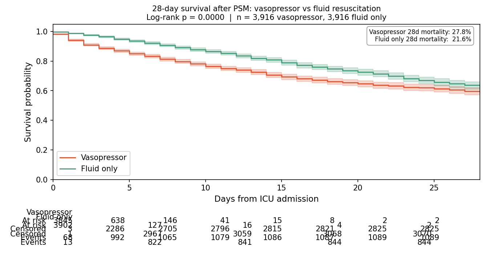
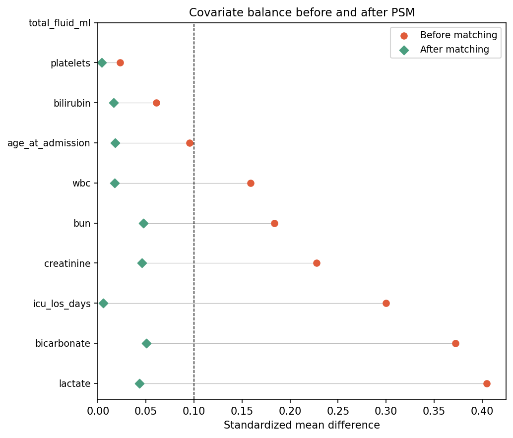
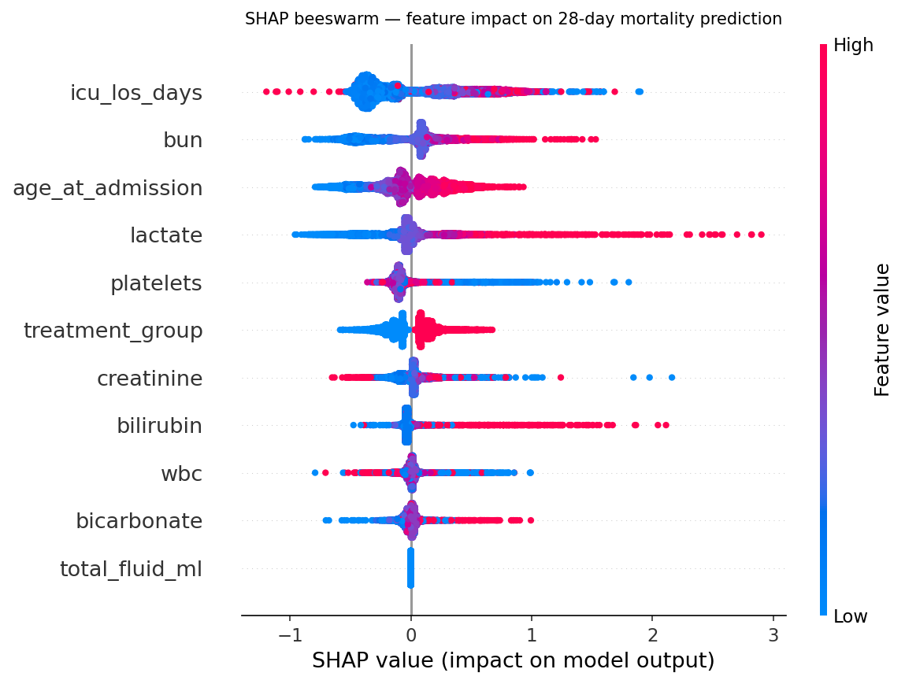

# Comparative Effectiveness of Vasopressor vs Fluid Resuscitation
# in ICU Sepsis Patients: A Real-World Evidence Study


## Overview

A fully reproducible real-world evidence (RWE) study examining 28-day
mortality outcomes in ICU sepsis patients treated with vasopressors versus
fluid resuscitation alone, using MIMIC-IV electronic health record data.

This project demonstrates an end-to-end clinical data science workflow:
raw EHR data ingestion -> dbt pipeline -> propensity score matching ->
survival analysis -> SHAP interpretability.

---

## Clinical Question

> Among adult ICU patients with sepsis, is vasopressor use in the first
> 24 hours of ICU admission associated with different 28-day mortality
> compared to fluid resuscitation alone, after controlling for
> baseline severity?

---

## Key Results

| | Vasopressor | Fluid only |
|---|---|---|
| N (matched) | 3,916 | 3,916 |
| 28-day mortality | 27.8% | 21.6% |
| Median time-to-event (days) | 9 | 9 |

**Adjusted HR: 1.37 (95% CI 1.27–1.48, p = 0.000)**







---

## Study Design

| Parameter | Choice | Rationale |
|---|---|---|
| Population | Adult ICU patients, sepsis ICD-10 | Clinically defined cohort |
| Exposure | Vasopressor use within 24h of ICU admit | Limits immortal time bias |
| Comparator | Crystalloid/colloid fluid only | Active comparator design |
| Outcome | 28-day all-cause mortality | Standard ICU trial endpoint |
| Index date | First ICU admission | Consistent temporal anchor |
| Exclusion | Age <18, >89, ICU LOS <4h | Removes edge cases |
| Confounding | Propensity score matching (1:1 NN) | Balances baseline severity |
| Caliper | 0.2 × SD(logit PS) | Austin (2011) standard |

---

## Methods

### Data source
MIMIC-IV v3.1 (Beth Israel Deaconess Medical Center, 2008–2022).
Access via PhysioNet credentialing. Hosp and ICU modules used.

### Pipeline
Raw MIMIC-IV tables are loaded into Snowflake and transformed via
a dbt project into analysis-ready models:

```
RAW (Snowflake)
  └── staging/         stg_patients, stg_admissions,
  │                    stg_diagnoses, stg_icustays
  └── marts/           int_sepsis_cohort
                       int_treatment_flags
                       mart_analysis_cohort   ← Python reads this
```

### Propensity score matching
Logistic regression on 11 covariates (demographics, organ dysfunction
labs, ICU LOS). 1:1 nearest-neighbor matching without replacement.
Caliper: 0.2 × SD(logit PS). Balance assessed via standardized mean
difference (SMD < 0.1 threshold).

### Survival analysis
Kaplan-Meier curves with log-rank test. Cox proportional hazards
model with L2 penalization (penalizer=0.1) adjusting for residual
covariate imbalance post-matching. Proportional hazards assumption
tested via Schoenfeld residuals.

### Interpretability
Gradient boosted classifier + SHAP TreeExplainer to characterize
non-linear feature effects and treatment effect heterogeneity
beyond the Cox model.

---

## Repo structure

```
mimic-rwe/
├── dbt_project.yml
├── profiles.yml              # gitignored
├── models/
│   ├── staging/
│   │   ├── stg_patients.sql
│   │   ├── stg_admissions.sql
│   │   ├── stg_diagnoses.sql
│   │   └── stg_icustays.sql
│   └── marts/
│       ├── int_sepsis_cohort.sql
│       ├── int_treatment_flags.sql
│       └── mart_analysis_cohort.sql
├── notebooks/
│   ├── 01_cohort_eda.ipynb
│   ├── 02_psm.ipynb
│   ├── 03_survival.ipynb
│   └── 04_shap.ipynb
├── figures/
├── data/                     # gitignored
├── Dockerfile
├── requirements.txt
└── README.md
```

---

## Reproducing this analysis

### Prerequisites
- PhysioNet credentialed MIMIC-IV access
- Snowflake account (free trial works)
- Docker

### Setup

```bash
git clone https://github.com/leen01/mimic-rwe
cd mimic-rwe

# copy and fill in your credentials
cp .env.example .env

# build and run container
docker build -t mimic-rwe .
docker run --env-file .env -v $(pwd):/app mimic-rwe
```

### Run dbt models

```bash
dbt run --select staging.*
dbt run --select int_sepsis_cohort
dbt run --select int_treatment_flags
dbt run --select mart_analysis_cohort
dbt test
```

### Run notebooks

```bash
jupyter lab notebooks/
```

Run in order: `01` -> `02` -> `03` -> `04`

---

## Limitations

- **Residual confounding:** Unmeasured severity indicators (APACHE score,
  vasopressor dose) not fully captured in MIMIC-IV.
- **Single-center data:** BIDMC only — generalizability limited.
- **ICD coding:** Sepsis ICD codes have known sensitivity/specificity
  limitations as a cohort definition.
- **Immortal time:** 24-hour treatment window mitigates but does not
  fully eliminate immortal time bias.

---

## References

- Goldberger, A., Amaral, L., Glass, L., Hausdorff, J., Ivanov, P. C., Mark, R., ... & Stanley, H. E. (2000). PhysioBank, PhysioToolkit, and PhysioNet: Components of a new research resource for complex physiologic signals. Circulation [Online]. 101 (23), pp. e215–e220. RRID:SCR_007345.
- Austin PC. An introduction to propensity score methods for reducing
  confounding. *Multivariate Behavioral Research* 2011.
- Schoenfeld D. Partial residuals for the proportional hazards
  regression model. *Biometrika* 1982.
- Lundberg SM, Lee SI. A unified approach to interpreting model
  predictions. *NeurIPS* 2017.

---

## Author

**Nicholas Lee** — Data Scientist
[nick-lee.com](https://nick-lee.com) ·
[GitHub](https://github.com/leen01) ·
[LinkedIn](https://linkedin.com/in/leen01)